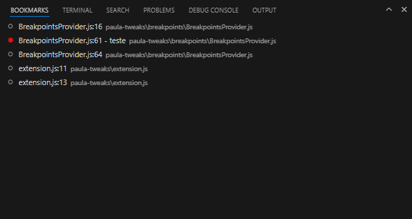
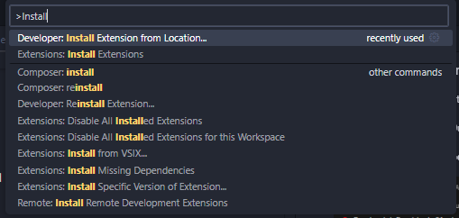

# Paula's tweaks README

This is my personal extension for vscode.

## Version
**0.1.0**

## Features

### Breakpoints as Bookmarks
Use the VsCode Breakpoints as Bookmarks.

Creates a panel near the Output Panel, that lists the Breakpoints and show if they're enabled.

If the breakpoint is a **Logpoint**, it will show the logmessage as well.

## Instalation
I have not (and probably will not) added the extension to the VsCode Marketplace, so for now, you can install the extension as a Developer Version.

To do so:
1. clone/download this repository,
2. open vscode, and then use the `Developer: Install Extension From Location...` command
    - 
3. Choose the folder you just cloned and that's it.
4. To update, just clone pull the main branch, or download it again and overwrite the current instalation.

## Release Notes

### 0.1.0
- Initial release of the Breakpoints as Bookmarks feature.
