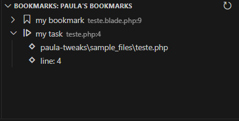

# Paula's tweaks Vs Code Extension

This is my personal extension for Vs Code. That I will gradually update with new features.

## Version
**0.2.0**

## Features

### Comments as Bookmarks
Use Comments as Bookmarks, if you comment "@do: my task" or "@bookmark: my bookmark", the comment will show in the bookmarks panel.

This extension was only tested in Javascript and PHP (including blade).

#### Settings
- `paula.bookmarks.extensions`: You can config the file extensions using this setting, This setting expects an array of extensions.
  - default: `[".js", ".php", ".blade.php", ".ts", ".vue"]`.
- `paula.bookmarks.folderMode`: Mode for folder filtering: 'include' to only scan specified folders, 'exclude' to scan all except specified folders
  - default: `"exclude"`
- `paula.bookmarks.includeFolders`: Folders to include when scanning for bookmarks (relative paths from workspace root). Use pattern like 'src/*' to include all subfolders.
  - default: `[]`
- `paula.bookmarks.excludeFolders`: Folders to exclude when scanning for bookmarks (relative paths from workspace root). Use pattern like 'src/tests/*' to exclude all subfolders.
  - default: `["node_modules", "vendor", "dist", "build", ".git"]`

## Instalation
I have not added, (and probably will not add) the extension to the VsCode Marketplace, so for now, you can only install the extension manually.

To do so:
1. clone/download this repository,
2. open vscode, and then use the `Developer: Install Extension From Location...` command
    - 
3. Choose the folder you just cloned, and that's it.
4. To update, just pull the main branch, or download it again and overwrite the current instalation.

## Release Notes

### 0.1.0
- Initial release of the Breakpoints as Bookmarks feature.
